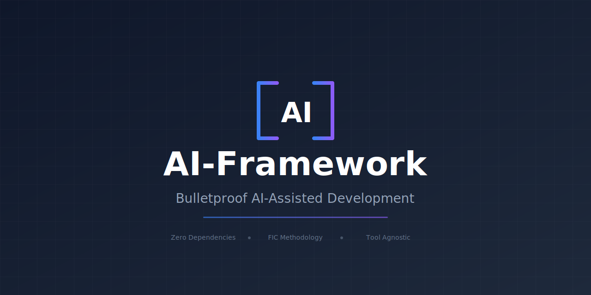
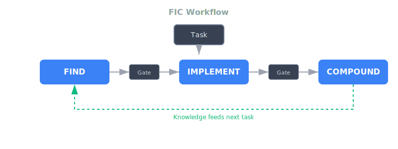
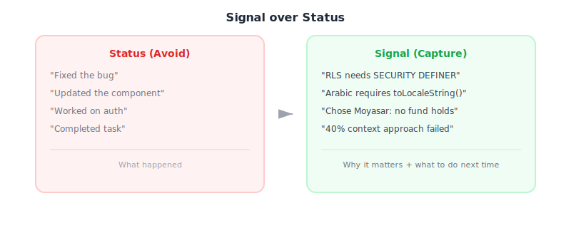
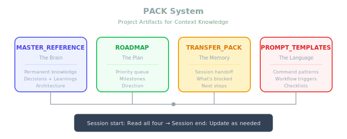

<p align="center">
  
</p>

<p align="center">
  <strong>Bulletproof AI-Assisted Development</strong>
</p>

<p align="center">
  <a href="CHANGELOG.md"></a>
  <a href="LICENSE"></a>
  <a href=".github/CONTRIBUTING.md"></a>
  
  <a href="https://github.com/Alaslani/AI-Framework/actions"></a>
</p>

<p align="center">
  
</p>

<p align="center">
  
</p>

<p align="center">
  
</p>

---

> **Zero dependencies** — No packages to install, no CLI tools, no configs. Just copy the markdown files and start working. Verification commands shown below are for *your* project's toolchain, not framework requirements.

<p align="center">
  → Copy this link and ask your AI: "Set up AI-Framework for my project"
</p>

```
https://github.com/Alaslani/AI-Framework
```

A simple, scalable methodology for AI-assisted development.

## Introduction

AI has transformed software development. What once took weeks now takes hours. But this speed creates new challenges: unclear requirements become expensive mistakes faster, context gets lost between sessions, and hard-won learnings disappear when conversations end.

AI-Framework solves these problems with a structured methodology that works for any project, any language, any team size. It focuses on the highest-leverage activities—research and planning—while providing patterns for context management, session continuity, and knowledge preservation.

This is not a boilerplate or template. It's an opinionated guide based on patterns proven across 50+ development sessions. Use what works for you, adapt what doesn't, and stay consistent.

## What makes a project "bulletproof"?

- **Clarity over speed** — Know what to build before building it
- **Signal over ceremony** — Capture learnings, not just status
- **Context under control** — Keep AI context under 40% for better reasoning
- **Knowledge compounds** — Every session makes the next one better
- **Verification at every gate** — Type check, lint, build, test

## Table of Contents

- [Overview](docs/overview.md)
- [Getting Started](docs/getting-started.md)
- [Golden Path (Cheat Sheet)](GOLDEN_PATH.md)
- **Methodology**
  - [FIC Workflow](docs/methodology/fic-workflow.md)
  - [PACK System](docs/methodology/pack-system.md)
  - [Phased Development](docs/methodology/phased-development.md)
  - [Validation Gates](docs/methodology/validation-gates.md)
- **Patterns**
  - [Session Handoff](docs/patterns/session-handoff.md)
  - [Project Knowledge](docs/patterns/project-knowledge.md)
  - [Decision Logging](docs/patterns/decision-logging.md)
  - [Subagent Usage](docs/patterns/subagent-usage.md)
  - [Context Warning Signs](docs/patterns/context-warning-signs.md)
  - [Cross-Project Patterns](docs/patterns/cross-project-patterns.md)
- **Guides**
  - [Anti-Patterns](docs/anti-patterns.md)
  - [Compound Checklist](docs/compound-checklist.md)
  - [Exit Test](docs/exit-test.md)
  - [FIC Loop Diagram](docs/fic-loop.md)
  - [Framework Contract](FRAMEWORK_CONTRACT.md)
- **Memory**
  - [Memory Setup](docs/memory-setup.md)
  - [AI Memory System](docs/memory/ai-memory-system.md)
  - [Cross-Project Learning](docs/memory/cross-project-learning.md)
- **Integrations**
  - [Notion](docs/integrations/notion.md)
  - [Prompt Templates](docs/integrations/prompt-templates.md)
  - [Other Tools](docs/integrations/other-tools.md) — Cursor, Windsurf, Copilot, Aider
- [Templates](templates/)
- [Examples](examples/) — Filled templates for web, mobile, API projects
- [References](REFERENCES.md) — Methodology sources and credits
- [Security Guide](SECURITY.md) — Vibe coding security checklist

## Quick Start

1. Copy `templates/MASTER_REFERENCE.md` to your project
2. Fill in project-specific sections
3. Start every AI session by pointing to your MASTER_REFERENCE
4. Use `templates/TRANSFER_PACK.md` to hand off between sessions
5. Capture learnings in your MASTER_REFERENCE after each session

## The PACK System

**P**roject **A**rtifacts for **C**ontext **K**nowledge — the 4 documents that preserve context across sessions:

| Document | Purpose | Update Frequency |
|----------|---------|------------------|
| **MASTER_REFERENCE** | Permanent project knowledge (the brain) | After learnings |
| **ROADMAP** | Direction and priorities (the plan) | Weekly or milestone |
| **TRANSFER_PACK** | Session handoff (the memory) | Every session end |
| **PROMPT_TEMPLATES** | Command patterns (the language) | As workflows evolve |

## Workflow Quick Reference

### Setup (Once)

```bash
# Copy templates to your project
cp -r templates/ /path/to/your/project/
```

### Every Session

**Start:**

```
1. Read MASTER_REFERENCE
2. Read TRANSFER_PACK (if exists)
3. State task → Pick workflow
```

**End:**

```
1. Update TRANSFER_PACK
2. Add learnings to MASTER_REFERENCE
3. Note next steps
```

### FIC Workflow

| Phase | Action | Output |
|-------|--------|--------|
| **Find** | Understand files, data flow, constraints | Research notes |
| **Implement** | Plan (3-5 phases) → Execute → Verify | Working code |
| **Compound** | Capture learnings | Updated knowledge |

### Verification (After Every Phase)

```bash
# JavaScript/TypeScript
npm run type-check && npm run lint && npm run build && npm run test

# Python
mypy . && ruff check . && pytest

# Generic
# 1. Type check
# 2. Lint
# 3. Build
# 4. Test
```

### Context Check (Claude Code)

```bash
# Check context usage
/tokens

# Clear if needed
/clear

# Compact with care (prefer manual PROGRESS.md)
```

### When to Use What

| Task | Workflow |
|------|----------|
| Quick fix (<50 lines) | Direct implement |
| Clear scope, single file | Brief plan → implement |
| Multi-file feature | Full FIC |
| Unknown territory | FIC + extra Find |

### Context Rules

| Rule | Threshold |
|------|-----------|
| Target context | < 40% |
| Reset context | > 60% or same error 3x |

> See [Golden Path](GOLDEN_PATH.md) for full cheat sheet.

## Contributing

Contributions welcome! See [CONTRIBUTING.md](.github/CONTRIBUTING.md).

## License

[MIT](LICENSE)
