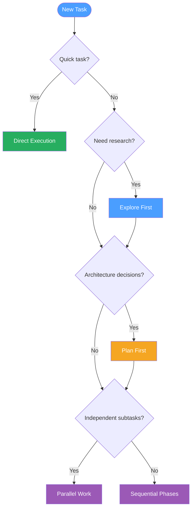

# Agent Selection Flowchart

Decision tree for choosing the right approach when working with Claude Code.

| Pattern | When to Use | Example |
|---------|-------------|---------|
| Direct execution | < 20 lines, one file, obvious change | Fix a typo, add an import |
| Explore first | Unfamiliar code, need to trace data flow | Debug a cross-module issue |
| Plan first | Multiple files, architectural decisions | Add a new feature with API + UI |
| Parallel work | Independent tasks, no shared state | Lint fix + test addition + docs update |
| Sequential phases | Ordered dependencies between steps | Database migration then API then UI |

**When to use:** Deciding how to approach a new task, or explaining to someone why certain tasks need research before implementation.

*See: [Subagent Usage](../patterns/subagent-usage.md), [Phased Development](../methodology/phased-development.md)*
