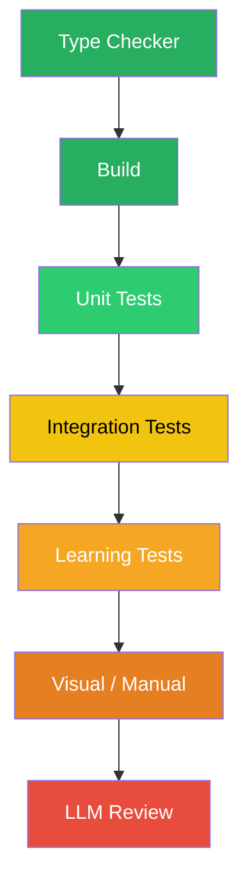

# Back Pressure Pyramid

The verification hierarchy from most deterministic (top) to least deterministic (bottom). Higher layers produce more trustworthy signals.

| Signal | Reliability |
|--------|-------------|
| Green | Deterministic — pass or fail, no interpretation |
| Yellow | Semi-deterministic — depends on test quality |
| Red | Probabilistic — can be steered by prompt |

**When to use:** Explaining why type checkers matter more than LLM self-review, or auditing which verification layers a project has in place.

*See: [Back Pressure Engineering](../methodology/back-pressure.md)*
