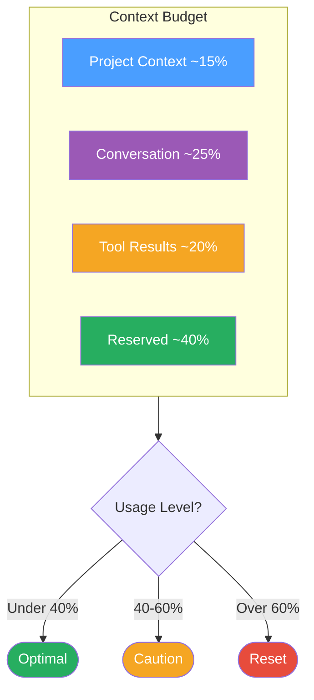

# Context Engineering

How AI context budget is allocated across a session, and what triggers a fresh context.

**Fresh context triggers:**
- Context usage exceeds 60%
- 3 or more repeated errors in a row
- AI starts producing inconsistent or contradictory output
- Switching to a fundamentally different task

**When to use:** Explaining context management to users hitting quality degradation, or planning how much project context to load at session start.

*See: [Context Warning Signs](../patterns/context-warning-signs.md)*
