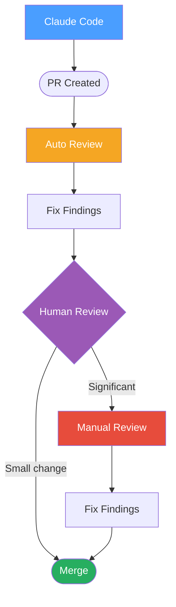

# Dual Verification Model

How implementing and reviewing models complement each other in the PR lifecycle.

**Key finding:** Auto and manual reviews find different issues — they stack, they don't overlap.

| Review Type | Catches | Cost |
|-------------|---------|------|
| **Auto review** | Style violations, obvious bugs, type issues | Low — runs on every PR |
| **Manual review** | Design flaws, missing edge cases, architecture drift | Higher — reserve for significant changes |
| **Combined** | Both layers together | Highest value — different blind spots |

**When to use:** Setting up a cross-model review workflow, or explaining why auto-review alone isn't sufficient for architecture changes.

*See: [Evals System](../methodology/evals-system.md)*
