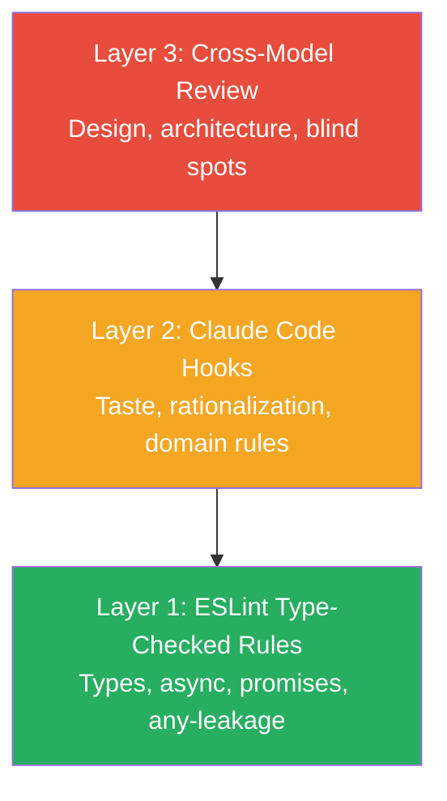

# 3-Layer Evals Pyramid

Automated quality enforcement layers, ordered from most deterministic (bottom) to least deterministic (top).

| Layer | What It Catches | Determinism |
|-------|----------------|-------------|
| **Layer 1:** ESLint | Types, async, promises, any-leakage | Highest — same code, same result |
| **Layer 2:** Hooks | Taste, rationalization, domain anti-patterns | High — shell scripts, deterministic |
| **Layer 3:** Cross-Model | Design, architecture, blind spots | Lower — different model, different perspective |

**When to use:** Introducing the evals system to someone unfamiliar with it, or deciding which layer to invest in next.

*See: [Evals System](../methodology/evals-system.md)*
