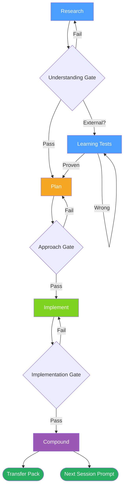

# FIC Workflow

The Find → Implement → Compound development loop with validation gates between each phase.

**Legend:**

| Color | Meaning |
|-------|---------|
| 🔵 Blue | Find — Research / Learning Tests |
| 🟠 Orange | Plan |
| 🟢 Green | Implement |
| 🟣 Purple | Compound |
| 🟩 Dark green | Handoff artifacts — Transfer Pack + Next Session Prompt |
| ◇ Diamond | Validation gate (Pass continues, Fail loops back) |

**When to use:** Explaining the core FIC methodology to new users, or as a quick reference for the development loop and where gates sit between phases.

*See: [FIC Workflow](../methodology/fic-workflow.md)*
