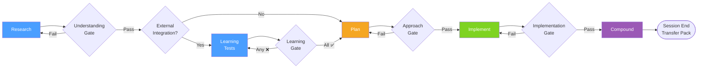

# FIC Workflow

The Find → Implement → Compound development loop with validation gates between each phase.

**When to use:** Explaining the core FIC methodology to new users, or as a quick reference for the development loop and where gates sit between phases.

*See: [FIC Workflow](../methodology/fic-workflow.md)*
