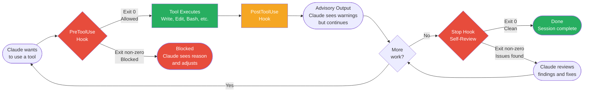

# Hook Execution Flow

How Claude Code hooks interact with tool execution during a session.

| Hook Type | When It Runs | Behavior | Use For |
|-----------|-------------|----------|---------|
| **PreToolUse** | Before tool execution | Blocks if exit non-zero | Protecting paths, enforcing rules |
| **PostToolUse** | After tool execution | Advisory only, never blocks | File size warnings, import checks |
| **Stop** | When Claude finishes | Can send Claude back to fix | Anti-rationalization, taste review |

**When to use:** Understanding how hooks fit into the Claude Code tool execution cycle, or debugging why a hook isn't triggering as expected.

*See: [Evals System](../methodology/evals-system.md)*
