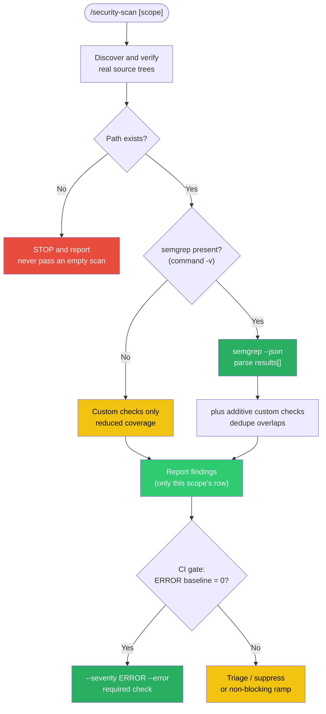

# Security Scan Flow

How `/security-scan` produces an *honest* result — verify the path, separate tool detection from result evaluation, run custom checks additively — and how the CI gate rolls out safely.

| Signal | Meaning |
|--------|---------|
| Green | Trustworthy path — real scan, `results[]` parsed, gate enforced |
| Yellow | Reduced coverage or not-yet-blocking — proceed, but say so |
| Red | Stop — refuse to report a clean result you did not earn |

**When to use:** Explaining why a scan can pass while finding nothing real (a missing path, a misread exit code), or planning a safe CI gate rollout.

*See: [Semgrep SAST + /security-scan](../methodology/semgrep-sast.md)*
