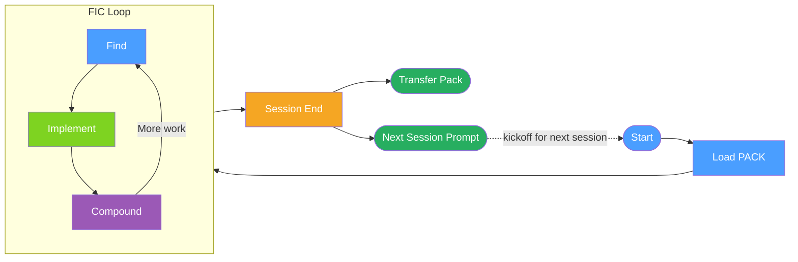

# Session Lifecycle

The full lifecycle of an AI-assisted development session, from loading context to preserving knowledge.

**Legend:**

| Color | Meaning |
|-------|---------|
| 🔵 Blue | Start / Load PACK / Find |
| 🟢 Green | Implement |
| 🟣 Purple | Compound |
| 🟠 Orange | Session End |
| 🟩 Dark green | Handoff artifacts — Transfer Pack + Next Session Prompt |

**Key points:**
- **Start:** Always load existing PACK documents for continuity
- **FIC Loop:** Repeats within a session — multiple find-implement-compound cycles are normal
- **End:** Capture learnings, create a Transfer Pack (the state), and write a Next Session Prompt (the kickoff to paste) so the next session starts ahead

**When to use:** Onboarding someone to the AI-Framework workflow, or explaining why session start and end rituals matter for knowledge compounding.

*See: [Session Handoff](../patterns/session-handoff.md), [FIC Workflow](../methodology/fic-workflow.md)*
